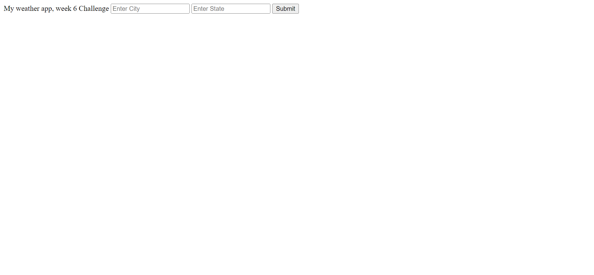

# My-Weather-News

## Weather App

The motivation for this project was to practice using fetch requests to call api's. Once data returned from api's in the form of objects/arrays the wrote code to traverse the object to get desired data.

I learned how implementing the use of the following functions:

 fetch

 traversing objects to get desired data.

## Table of Contents

1). My Weather News.

## Usage

Github repository: https://github.com/robscafe433/My-Weather-News

github pages url: https://robscafe433.github.io/My-Weather-News/

Webpage Screenshot:

<!-- example code below -->
   

## Badges

